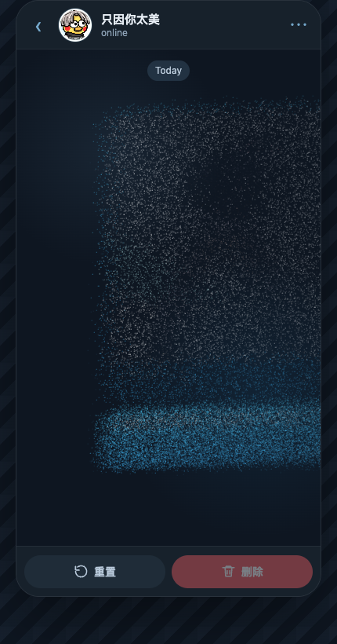

# ikun-tg-dissolve

一个前端复刻的 TG 风格消息销毁动效：点击删除后，聊天气泡会先模糊，再碎成细密像素粒子，被风吹散。

<p align="center">
  
  
</p>

<p align="center">
  <a href="./delete-reset-loop3.mp4">查看删除 + 重置三连演示 MP4</a>
</p>

## 特点

- TG 风格聊天窗口 UI
- 图片气泡 + 文本气泡同时销毁
- DOM 气泡离屏绘制成 Canvas
- `getImageData` 像素采样生成粒子
- 右向风场、延迟扩散、上浮、下坠和扰动
- 细密微像素粒子，接近 TG 的噪点消散质感
- 删除 / 重置双按钮，方便反复查看
- Canvas DPR 和粒子数量做了性能限制

## 在线运行

这是一个纯前端静态 Demo，不需要安装依赖。

```bash
git clone git@github.com:kryoncode/ikun-tg-dissolve.git
cd ikun-tg-dissolve
open demo.html
```

也可以直接用任意静态服务器打开：

```bash
python3 -m http.server 8080
```

然后访问：

```text
http://localhost:8080/demo.html
```

## 文件说明

```text
demo.html                    主 Demo
avatar.png                   聊天头像
bubble-photo.png             原始气泡图片
bubble-photo-inline.jpg      压缩后的展示图片
bubble-photo-data.js         图片 data URL，避免 Canvas 跨源污染
initial.png                  初始状态截图
dissolve-early.png           销毁早期截图
dissolve-mid.png             粒子消散中截图
delete-reset-loop3.mp4       删除 + 重置三连演示视频
effect-preview.mp4           单次删除预览
effect-preview-slow.mp4      慢速单次预览
effect-preview-slow-loop3.mp4 慢速三连预览
```

## 实现思路

核心流程：

```text
DOM 气泡
→ 离屏 Canvas 重新绘制
→ getImageData 读取非透明像素
→ 生成粒子数组
→ requestAnimationFrame 更新粒子
→ 原 DOM 隐藏
→ 粒子结束后清空 Canvas
```

每个粒子会记录：

- 原始位置：`ox / oy`
- 颜色：`r / g / b / a`
- 尺寸：`size`
- 随机透明度：`grain`
- 延迟：`delay`
- 风力：`wind`
- 漂移：`drift`
- 上浮：`lift`
- 下坠：`gravity`
- 扰动：`noise`

粒子运动主要由这些参数组合出来：

```js
const t = Math.min(local / settings.duration, 1);
const out = easeOutCubic(t);
const fall = easeInQuad(t);

const shake =
  Math.sin(local * p.wobbleRate + p.wobble) *
  p.noise *
  (1 - t);

const x = p.ox + p.wind * out + p.drift * t + shake;

const y =
  p.oy +
  p.lift * Math.sin(t * Math.PI) +
  p.gravity * fall +
  Math.cos(local * .018 + p.wobble) * 5 * (1 - t);
```

## 关键参数

```js
const settings = {
  pixel: .52,
  duration: 2850,
  startSpread: 620,
  wind: 138,
  lift: -26,
  gravity: 20,
  noise: 6,
  fadePower: 1.55,
  dustChance: .08,
  maxParticles: 42000
};
```

几个调参结论：

- `duration` 决定整体消散速度
- `startSpread` 决定从右向左释放粒子的时间差
- `fadePower` 越大，消失越快
- `maxParticles` 太高会卡，太低会稀疏
- 粒子用 `fillRect` 比圆形路径更省，也更像 TG 的微像素噪点

## 性能处理

为了避免卡顿：

- Canvas DPR 固定为 `1`
- 粒子总数限制为 `42000`
- 粒子超量后使用均匀抽样
- 每帧绘制不使用 `save / restore`
- 用 `fillRect` 绘制微像素粒子

均匀抽样可以避免从左到右提前截断，保证整个气泡都会参与粒子化。

## 示例视频

如果 GitHub 没有直接渲染视频，可以点击文件查看：

- [delete-reset-loop3.mp4](./delete-reset-loop3.mp4)
- [effect-preview.mp4](./effect-preview.mp4)
- [effect-preview-slow-loop3.mp4](./effect-preview-slow-loop3.mp4)

## 许可证

MIT
