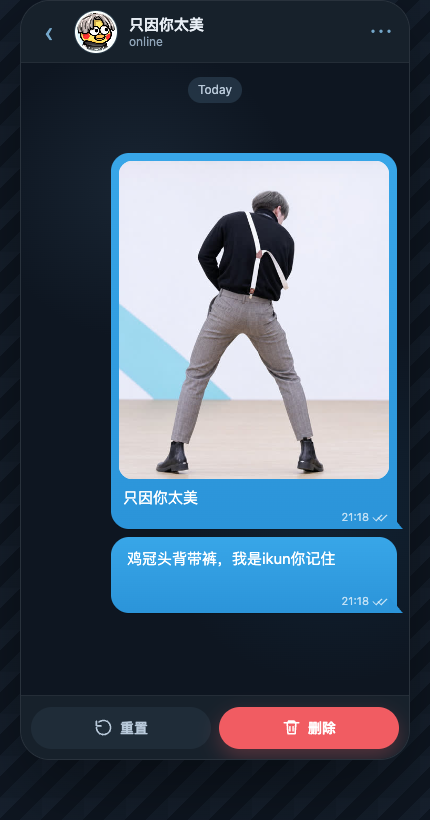

# ikun-tg-dissolve

前端复刻 TG 风格消息销毁动效：点击删除后，聊天气泡会先模糊，再碎成细密像素粒子，被风吹散。

<p align="center">
  
</p>

<p align="center">
  <a href="./delete-reset-loop3.mp4">查看删除 + 重置三连演示 MP4</a>
</p>

## 功能

- TG 风格聊天窗口
- 图片气泡 + 文本气泡同步销毁
- 删除 / 重置双按钮
- 离屏 Canvas 重绘气泡
- `getImageData` 像素采样
- Canvas 粒子随风飘散
- 粒子数量上限和均匀抽样，避免卡顿和缺块

## 运行

这是纯静态前端 Demo，不需要安装依赖。

```bash
git clone git@github.com:kryoncode/ikun-tg-dissolve.git
cd ikun-tg-dissolve
open demo.html
```

或使用本地静态服务器：

```bash
python3 -m http.server 8080
```

访问：

```text
http://localhost:8080/demo.html
```

## 文件

```text
demo.html                 主 Demo
avatar.jpg                聊天头像
bubble-photo-inline.jpg   聊天气泡图片
bubble-photo-data.js      图片 data URL，避免 Canvas 跨源污染
initial.png               README 示例截图
delete-reset-loop3.mp4    删除 + 重置三连演示视频
LICENSE                   MIT 许可证
```

仓库只保留一张 PNG 和一个 MP4，避免示例素材重复。

## 实现流程

```text
DOM 气泡
→ 离屏 Canvas 重新绘制
→ getImageData 读取非透明像素
→ 生成粒子数组
→ requestAnimationFrame 更新粒子
→ 原 DOM 隐藏
→ 粒子结束后清空 Canvas
```

## 核心参数

```js
const settings = {
  pixel: .52,
  duration: 2850,
  startSpread: 620,
  wind: 138,
  lift: -26,
  gravity: 20,
  noise: 6,
  fadePower: 1.55,
  dustChance: .08,
  maxParticles: 42000
};
```

## 性能处理

- Canvas DPR 固定为 `1`
- 粒子总数限制为 `42000`
- 粒子超量后均匀抽样
- 每帧绘制不使用 `save / restore`
- 微粒使用 `fillRect` 绘制

## 许可证

MIT
